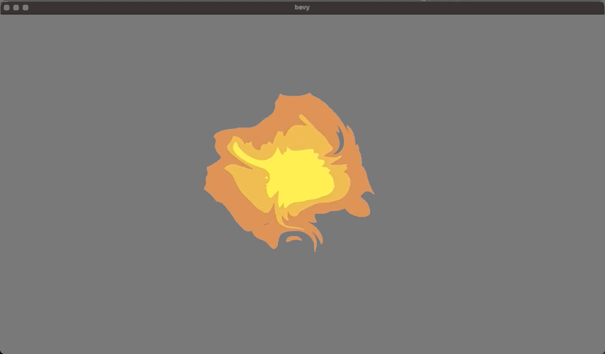

# Bevy zhuose qi

[](https://github.com/bevyengine/bevy/blob/main/docs/plugins_guidelines.md#main-branch-tracking)

Easy to use shaders for Bevy that works in native and on WebGL2.

Examples are deployed [on GitHub Pages](https://vleue.github.io/bevy_zhuose_qi/index.html).

## Top Down Fire

From https://github.com/wilk10/shader_practice/tree/main/src/shaders/fire

```rust
use bevy_zhuose_qi::topdownfire::*;

fn setup(
    mut commands: Commands,
    mut fire_textures: ResMut<Assets<FireTexture>>,
) {
    let my_texture_handle = asset_server.load("fire.png");
    commands.spawn_bundle(FireBundle {
        fire_texture: fire_textures.add(my_texture_handle.into()),
        ..Default::default()
    });
}
```


See the [examples](./examples) for a complete code example.
