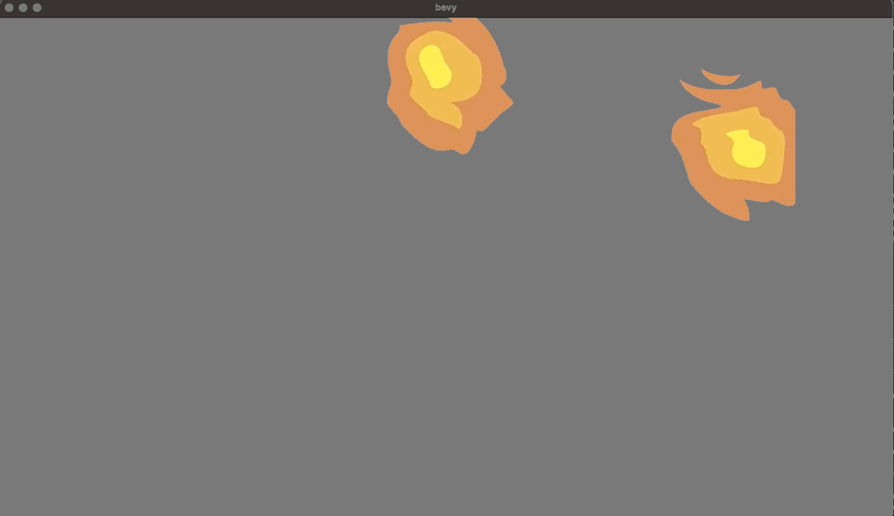

# Examples

## Top Down Fire

### [Simple Fire](./fire_simple.rs)

```
cargo run --example fire_simple --features examples
```


### [Colored Fires](./fire_colors.rs)

```
cargo run --example fire_colors --features examples
```


### [Fire Parameters](./fire_params.rs)

```
cargo run --example fire_params --features examples
```


### [Wild Fire](./fire_wild.rs)

```
cargo run --example fire_wild --features examples
```


## Laser

### [Laser](./laser.rs)

```
cargo run --example laser --features examples
```
https://raw.githubusercontent.com/vleue/bevy_zhuose_qi/main/examples/laser.mp4

### [Rotating Laser](./laser_rotating.rs)

```
cargo run --example laser_rotating --features examples
```
https://raw.githubusercontent.com/vleue/bevy_zhuose_qi/main/examples/laser_rotating.mp4
