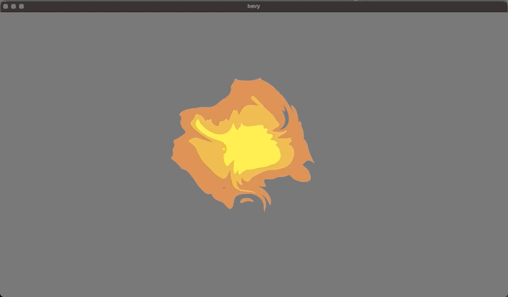
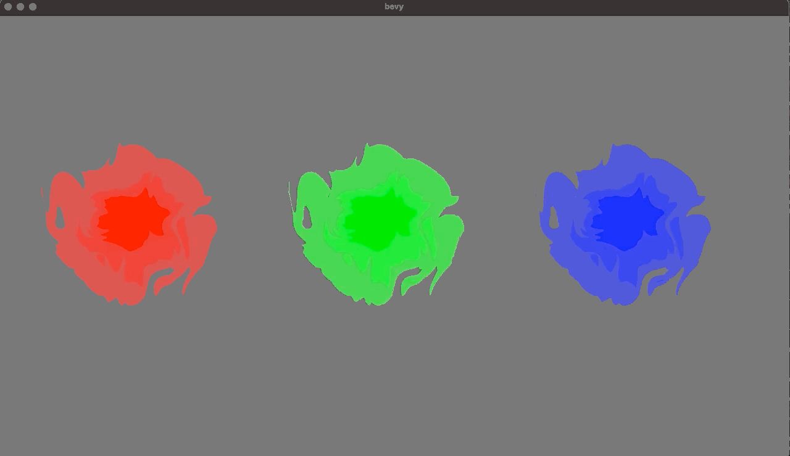
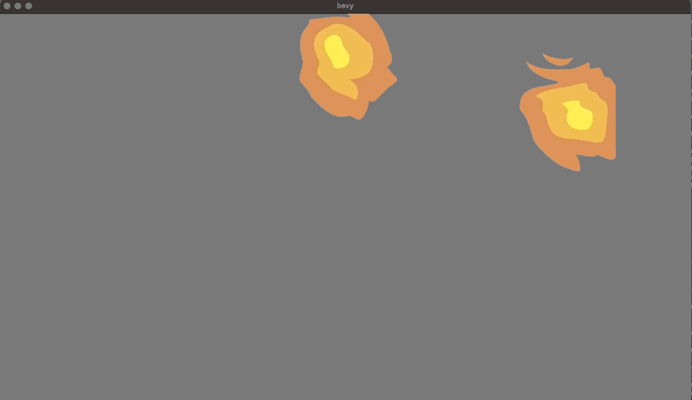

# Examples

## Top Down Fire

### [Single Fire](./single_fire.rs)

```
cargo run --example single_fire --features examples
```


### [Fire Colors](./fire_colors.rs)

```
cargo run --example fire_colors --features examples
```


### [Fire Parameters](./fire_params.rs)

```
cargo run --example fire_params --features examples
```


### [Wild Fire](./wild_fire.rs)

```
cargo run --example wild_fire --features examples
```


